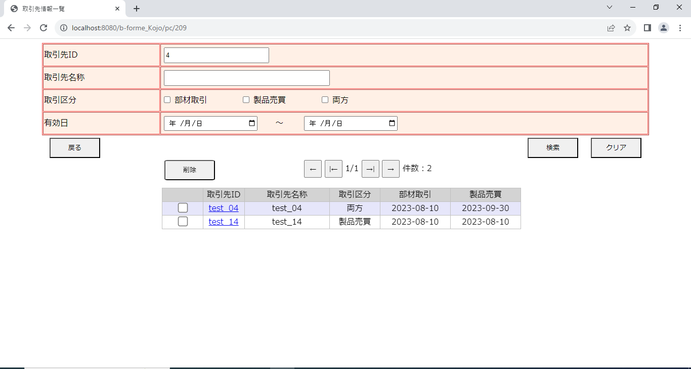
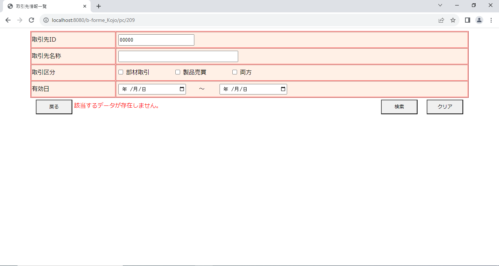

# 社内システム【取引先情報一覧】
インターンシップ先のチーム開発で、担当したページのコントローラ・サービス・リポジトリ・ビューです。 
登録した取引先情報の検索や削除ができる画面です。  
制作時間:6日 

# 使用技術
・Java  
・Spring Boot  
・Thymeleaf 
・MySQL 

# こだわったポイント
　コメントを忘れずに書くことや1文づつの改行を統一をするなど、 
　他の人が見てもわかりやすくなるように心がけました 

# 苦労したポイント
　ページネーションの実装の作業が初めてだったため、 
　調べたり実装する作業で苦労しました。 

# 機能
・取引先情報の検索機能  
検索項目に一致した取引先情報をデータベースから取得して表示します。 

【初期画面】

【無条件検索画面1ページ目】

【無条件検索画面2ページ目】

【ID検索】

【エラー画面（有効日エラー）】

【エラー画面（検索結果なし）】

 
 
 
・取引先情報の削除機能  
選択した取引先情報を取引先情報リストから削除します。(複数可) 

【削除成功時の画面】

【削除失敗時の画面（チェックボックス未選択）】
